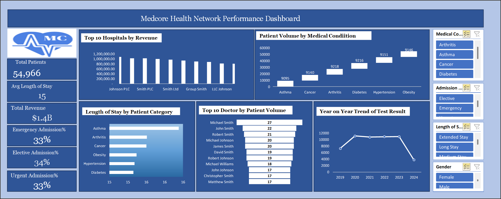

# Medcore Health Network — Excel Healthcare Analytics

An Excel healthcare analytics project summarising large-scale patient, revenue and utilisation performance across **54,966 patients**.

[View the supporting project](https://mayfuns.github.io/mariam-analytics-portfolio/supporting-projects.html#medcore)



## Headline metrics

| KPI | Result |
| --- | ---: |
| Patients | **54,966** |
| Revenue | **$1.4B** |
| Average length of stay | **15 days** |

## Excel workbook

[Open the original Medcore Healthcare Analysis workbook](02_excel/Medcore%20Healthcare%20Analysis.xlsx)

The repository now includes the original Excel analysis workbook alongside the exported dashboard, providing the underlying project evidence for the network-level healthcare analysis.

## Tools and skills

- Microsoft Excel
- Healthcare analytics
- Large-dataset analysis
- Operational reporting
- Revenue analysis
- Dashboard design

## Repository structure

```text
01_dashboard/
02_excel/
03_data/
04_documentation/
```

## Portfolio

- [Portfolio homepage](https://mayfuns.github.io/mariam-analytics-portfolio/)
- [Supporting projects](https://mayfuns.github.io/mariam-analytics-portfolio/supporting-projects.html#medcore)
